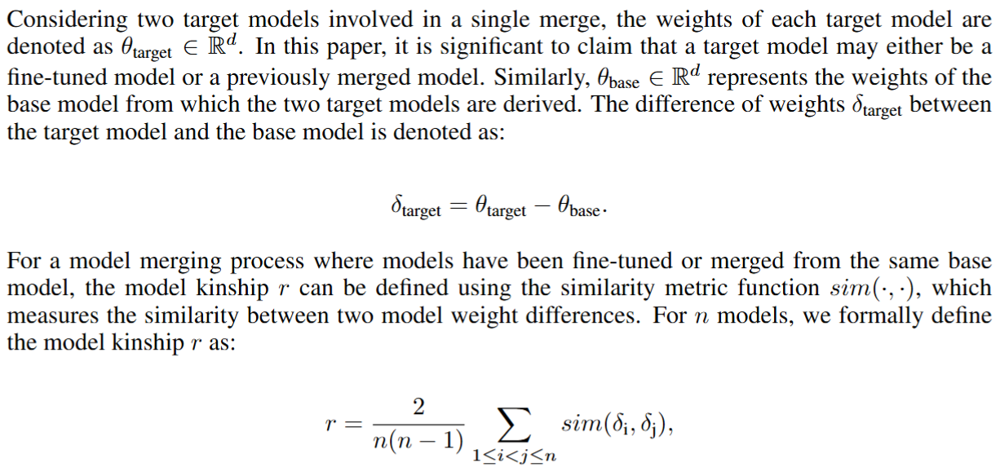
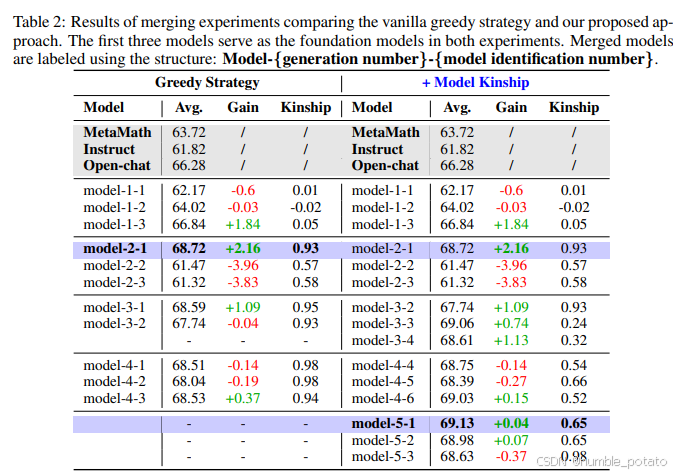

## NoteBookLM Speech

{}
This speech is generated by NotebookLM, and some points may not be explained clearly.
{}

<audio controls preload="auto">
 <source src="notebook.mp3">
</audio>

## Method

Motivated by the parallel drawn between biological reproduction and the process of model evolution, we propose that the concept of *kinship*, which is central to evolutionary biology for understanding breeding relationships and human genealogies, can be conceptually extended to the field of model merging, specifically to describe the kinship between models.

To be noted, [Ilarco et al., 2023](#) has proposed *Task Arithmetic* and offered new insights into how the merging process preserves and blends task information from the original models. A task vector is defined as the differences in weight space between fine-tuned models and a pre-trained model, and they demonstrate that arithmetic operations on these task vectors can serve as an effective method for model merging.

Inspired by this idea, we introduce the concept of *Model Kinship*, a metric designed to assess the degree of similarity or relatedness between large language models (LLMs) based on their "genetic" information (a.k.a. the changes in weights during model evolution).  

## Results

The results are divided into two parts. The first part is a statistical analysis of community merging evolution experiments, explaining the impact of model kinship on model merging and issues in the evolutionary process. The second part presents the main experiments, which reproduce the optimization issues caused by using a greedy strategy for iterative model merging and how model kinship can mitigate this problem.

In the preliminary analysis, we interpret the community experiments from different perspectives. The results in the article lead to two main conclusions:

1. There is a correlation between model kinship and the results of model merging. This finding suggests that kinship can potentially be used to predict merging outcomes, avoiding unnecessary merging without the need for costly evaluations.  
2. As iterative model evolution progresses, the kinship between the top models in the model repository gradually increases. At the same time, performance improvements among the top models tend to stagnate once the model kinship reaches a certain threshold.

We reproduced the second discovery in main experiments and pointed out that the rise in model kinship is due to the convergence of local optima generated by a certain generation's fusion. Subsequent merges abandon the search for better models and instead converge toward previously found optimal models. As an improvement, we integrate an exploration process based on model kinship into the conventional Top-k Greedy Merging, aiming to find better models by merging low-kinship models.

The final experimental results prove the effectiveness of this method.

## References
[1] Gabriel Ilharco, Marco T´ulio Ribeiro, Mitchell Wortsman, Ludwig Schmidt, Hannaneh Hajishirzi,
and Ali Farhadi. Editing models with task arithmetic. In The Eleventh International Confer-
ence on Learning Representations, ICLR 2023, Kigali, Rwanda, May 1-5, 2023. OpenReview.net, 2023. URL https://openreview.net/forum?id=6t0Kwf8-jrj.
